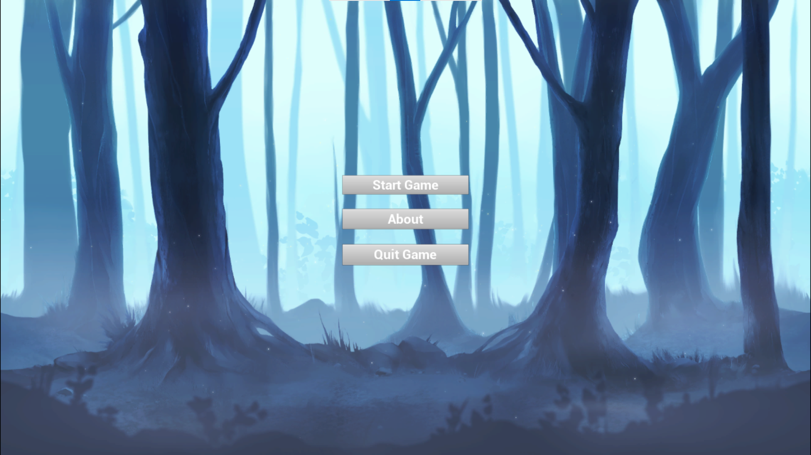
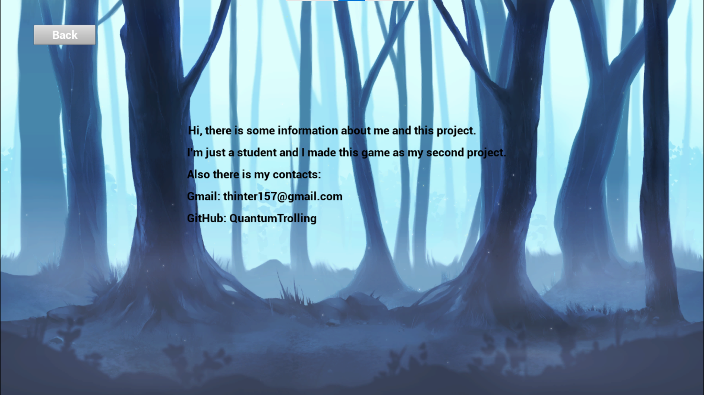
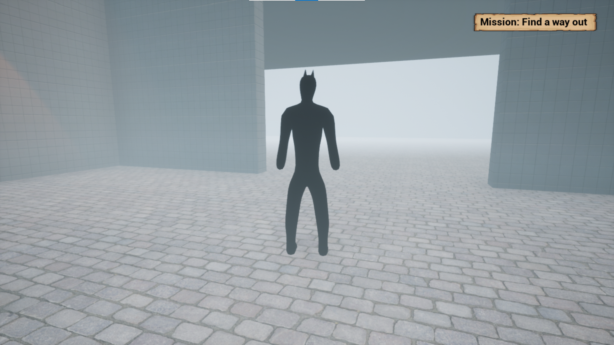
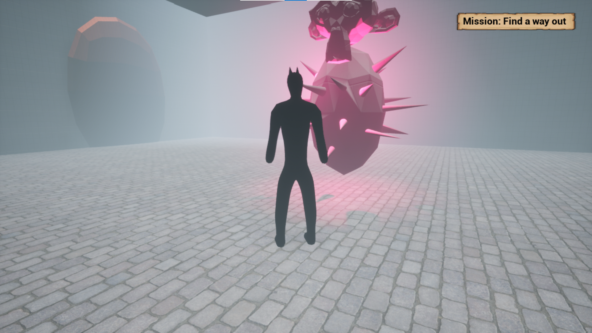
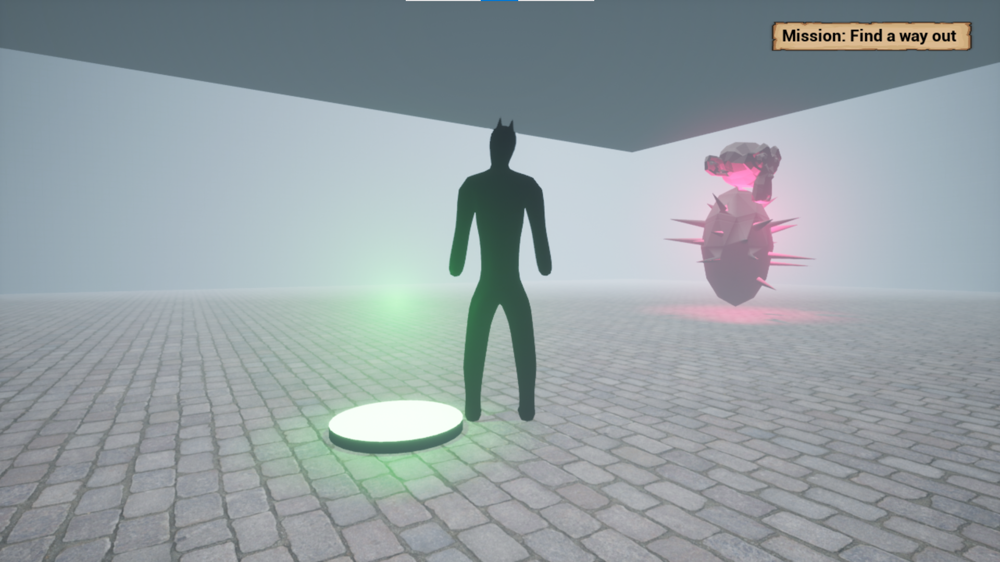

# Game-powered-by-UE4
Introduction:

This project it's a short game, which powered by "Unreal Engine 4". I made this game on subject “fundamental of programming”.

Walkthrough:

1. Main menu:

2.In the "About" you can see some information about creator of this game and find his contacts:

3. And there you can see peace of gameplay:

4.

5.

